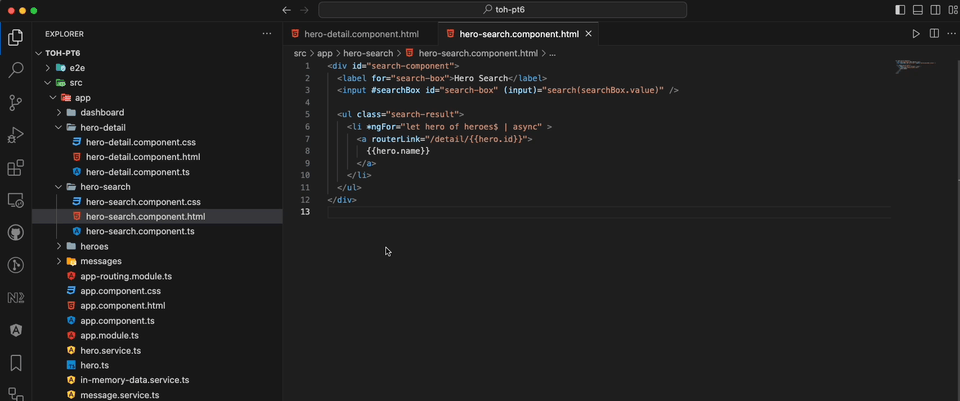
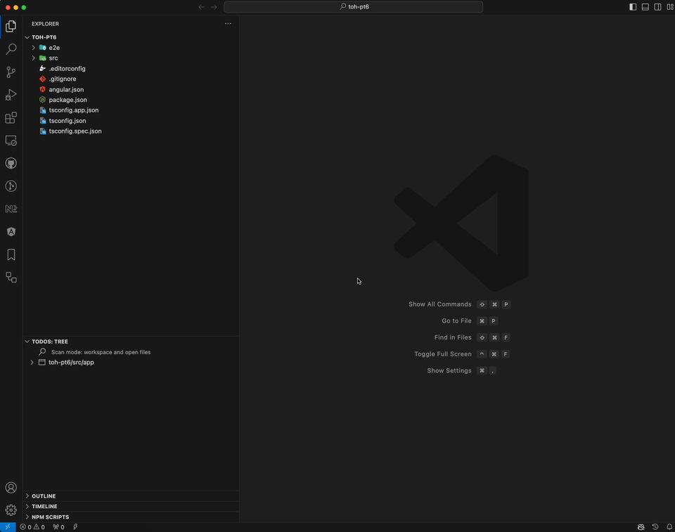

# Pendo Helper

A Visual Studio Code Extension that creates a random string that you can use as a unique css class for easier Pendo tracking.

## How to use

Open the Command Palette (Windows: CTRL+SHIFT+P, Mac: CMD+SHIFT+P) and type in Pendo.
You ll get two available commands. First one is Pendo Class which inserts a class with a unique string that can be used by Pendo for [Feature tagging](https://support.pendo.io/hc/en-us/articles/360031863612). The second command is Pendo Ignore that inserts a class that is used by Pendo to [exlude tracking](https://support.pendo.io/hc/en-us/community/posts/6068892939163-Tech-Note-Excluding-specific-elements-from-tracking-in-Pendo) of those elements.

## Download and install

Download the pendo-helper.vsix file from the [latest release](https://github.com/pgarzina/pendo-helper/releases/latest). From the Extensions dropdown select Install from VSIX and upload the .vsix extension file.

## About

The flow where once in a while when we need to add a Pendo class we have to look up at the documentation and find the site to generate a random string and copy paste it was a bit frustrating.
This should be a bit easier flow :)
